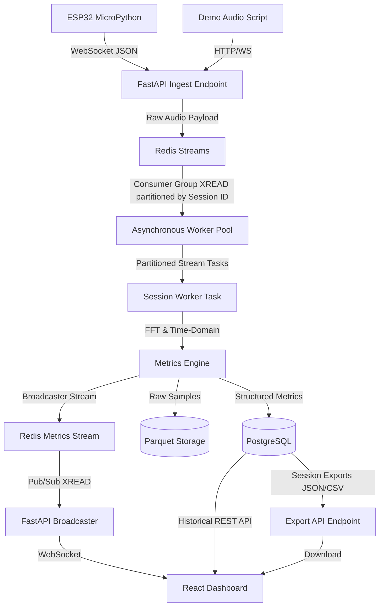

# Audio Waveform FFT Analyzer Dashboard

A comprehensive full-stack embedded and web system designed to capture analog audio, process the signal for real-time time-domain and frequency-domain analytics, and stream the data over WebSockets to a responsive web dashboard.

This project demonstrates a robust, scalable architecture for multi-device real-time signal analysis. It integrates high-performance embedded audio capture, an asynchronous event-driven backend, advanced digital signal processing (DSP), and a modern React-based visualization dashboard.

## 🌟 Key Features

### 🧮 Advanced Metrics Engine (DSP)
The custom DSP engine (`MetricsEngine`) performs continuous processing on 1024-sample packets:
- **Time-Domain Analysis**: RMS Energy, Peak Amplitude, Zero-Crossing Rate (ZCR).
- **Frequency-Domain Analysis (FFT)**: Peak Frequency estimation, Spectral Centroid, Spectral Rolloff (85%), and Spectral Flatness.
- **Rhythm Detection**: Autocorrelation-based BPM calculation utilizing an energy envelope over time.

### 💾 High-Performance Storage Layer
- **PostgreSQL Database**: Persistent storage for downsampled time-series audio metrics and session lifecycle management, accessed asynchronously via `asyncpg`.
- **Parquet Raw Storage**: Efficient columnar storage implementation for high-volume raw audio samples, optimizing disk I/O and enabling deep historical analysis.
- **Data Export**: Dedicated API endpoints for exporting session metrics and averages in JSON and CSV formats.

### 🖥️ Professional Analytic/intelligence Metrics from Raw Audio Samples
- **React + Vite Frontend**: High-performance, responsive UI crafted with a dark navy aesthetic.
- **Live Visualizations**: Synchronized scrolling oscilloscope (waveform),frequency spectrum (FFT) and zcr/rms/amp charts.
- **Session Management**: Live dashboard allows users to seamlessly switch subscriptions between active telemetry sessions.


The Session Intelligence Report is a high-level acoustic analytics layer built on top of the real-time audio processing pipeline.
It transforms raw waveform metrics into interpretable behavioral, spectral, and temporal observations using lightweight signal intelligence heuristics.

This module continuously analyzes incoming audio frames and generates contextual insights from:

RMS energy
Peak amplitude
Dominant frequency
Zero Crossing Rate (ZCR)
Temporal burst density
Frequency drift
Segment stability
Activity transitions

The result is a session-wide diagnostic overview capable of identifying unstable audio environments, noisy conditions, chaotic bursts, silence regions, and evolving acoustic behavior in real time.

flowchart LR
    A[Audio Stream] --> B[Frame Windowing]
    B --> C[Feature Extraction]

    C --> D1[RMS Energy]
    C --> D2[Amplitude]
    C --> D3[Dominant Frequency]
    C --> D4[Zero Crossing Rate]

    D1 --> E[Intelligence Layer]
    D2 --> E
    D3 --> E
    D4 --> E

    E --> F1[Pattern Classification]
    E --> F2[Drift Detection]
    E --> F3[Spike Detection]
    E --> F4[Timeline Segmentation]

    F1 --> G[Session Intelligence Report]
    F2 --> G
    F3 --> G
    F4 --> G

The engine derives semantic labels from statistical feature behavior.

Dominant Pattern

Represents the overall signal structure detected during the session.

Possible states:

steady
burst-heavy
chaotic
quiet-dominant
Tonality Classification

Determines whether the signal is harmonically stable or noise-like.

Derived from:

ZCR variance
Frequency consistency
Harmonic continuity

Possible states:

clean
balanced
noisy
Stability Class

Measures consistency of energy and spectral behavior over time.

Computed using:

RMS variance
Frequency variance
Temporal continuity

Possible states:

stable
variable
unstable
Activity Class

Estimates overall acoustic activity intensity.

Derived from:

Burst density
Energy occupancy
Signal persistence

Possible states:

low
moderate
high
Spike Profile

Detects transient high-energy events.

Detection logic includes:

RMS deviation thresholds
Sudden amplitude excursions
Short-duration spectral anomalies

Possible states:

minimal-spikes
occasional-spikes
burst-heavy
Drift Profile

Analyzes long-term frequency movement using EMA-smoothed spectral tracking.

Possible states:

stable
drifting
unstable
Frequency Drift Analysis

The frequency drift system tracks dominant spectral movement over time.

Features include:

Real-time dominant frequency tracing
EMA (Exponential Moving Average) smoothing
Drift slope estimation
Long-term spectral stability analysis
Derived Drift Metrics
Metric	Purpose
Slope (Hz/sample)	Long-term directional frequency movement
Burst Density	Frequency instability occurrence rate
Variance Spread	Frequency dispersion over time
EMA Trendline	Smoothed spectral movement estimate
Session Timeline Segmentation

The session timeline converts continuous audio into classified behavioral regions.

Each segment is categorized using rolling-window feature analysis.

Timeline States
State	Meaning
Quiet	Minimal signal activity
Stable	Consistent harmonic behavior
Active	Elevated signal activity
Burst-Heavy	Frequent transient spikes
Chaotic	Highly unstable acoustic behavior
Acoustic Intelligence Observations

The system generates contextual observations from combined feature analysis.

Example observations:

Moderate spike activity detected
Noisy broadband environment identified
Significant frequency drift observed
Chaotic acoustic segments detected

Each observation is assigned a confidence score derived from:

Statistical certainty
Feature agreement
Temporal persistence
Distribution Analysis

Histogram-based distribution analytics are generated for:

RMS energy
Amplitude
Zero Crossing Rate (ZCR)

The intelligence dashboard visualizes synchronized acoustic features over time:

RMS energy trace
Amplitude envelope
ZCR evolution
Spike markers
Silence gaps
Spectral transitions

This enables rapid identification of:

Acoustic instability
Sudden transients
Environmental noise shifts
Silence-to-activity transitions
Sustained harmonic regions
Technical Characteristics
Capability	Description
Real-Time Processing	Continuous streaming analysis
Lightweight Heuristics	No heavyweight ML inference required
Stream-Oriented	Compatible with Redis stream pipelines
Temporal Analysis	Rolling-window behavioral segmentation
Spectral Intelligence	Frequency-aware acoustic interpretation
Live Visualization	WebSocket-driven dashboard updates
Session Summarization	End-of-session intelligence synthesis
---

## 🏗️ System Architecture

The architecture is entirely event-driven, decoupling ingestion from processing and presentation.



### Flow Overview
1. **Ingestion**: Audio devices send chunked sample arrays and tokens to the FastAPI publisher endpoint.
2. **Buffering**: Payloads are pushed to a Redis Stream partitioned by `session_id`.
3. **Processing**: The `StreamWorker` (part of the asynchronous worker pool) processes incoming stream batches using consumer groups, calculating FFT-based metrics and rhythmic patterns.
4. **Storage**: Analyzed metrics are batch-inserted into PostgreSQL while raw samples are flushed to Parquet files.
5. **Broadcasting**: A global async broadcaster reads processed metrics from Redis and fans them out to connected dashboard WebSockets.
6. **Data Export**: The dashboard or external clients can request session data exports via REST API, retrieving historical session metrics and raw data in structured formats like JSON or CSV.

## 📊 Session Computation & Analysis Assumptions

The `MetricsEngine` executes an array of computations locally, abiding by the following assumptions and constraints for accuracy and performance:

### Baseline Normalizations
- **ADC Scaling**: Assumes hardware feeds 12-bit audio samples centered at `2048`. The engine applies an offset and scales values to a normalized `[-1.0, 1.0]` float range.
- **Sampling Parameters**: Default operations assume a uniform `48,000 Hz` sampling rate. Processing runs in discrete chunks (packets) of `1024` samples.
- **Windowing**: A standard Hann Window is applied to the time-domain data prior to FFT conversion to minimize spectral leakage at the chunk boundaries.

### Analysis Thresholds & Constraints
- **Silence Gating**: An RMS threshold of `0.005` is utilized. If a packet's RMS energy falls beneath this value, the packet is flagged as silent, and all respective metrics (frequency, BPM, centroids) are zeroed out to prevent noise amplification.
- **Frequency Bounds**: For peak frequency analysis, spectral bins are constrained between `20 Hz` and `5000 Hz` to reject DC bias (0 Hz) and extreme high-frequency hardware noise.
- **Spectral Rolloff**: Computed dynamically targeting **85%** of the total signal energy distribution.

### Rhythm (BPM) Autocorrelation
- **Energy Envelope**: Computed sequentially across rolling buffers. A minimum history of 60 packets is required before BPM calculation initiates.
- **Beat Constraints**: Valid peak intervals are filtered to bounds between `0.3s` and `1.5s` to strictly yield physiological or musical tempos lying between `40` and `200` BPM.

### Session Aggregations
- **Post-Session Summaries**: When exporting or querying a finalized session via the REST API, the system computes arithmetic averages spanning all collected rows for RMS energy, Peak Amplitude, and BPM to characterize the holistic session profile.
- 

## 🚀 Getting Started

### Prerequisites
- Docker & Docker Compose
- Node.js 16+ & Python 3.8+ (for local development)

### 🐳 Docker Deployment (Recommended)
The fastest way to run the entire stack (PostgreSQL, Redis, FastAPI Backend, Processing Worker, Nginx Frontend) is via Docker Compose:

```bash
# Build and start all services
docker-compose up --build

# To stop the containers
docker-compose down
```

Access the Web Dashboard at: `http://localhost:3000`

### 🔧 Hardware Setup (ESP32)
1. **Analog Circuitry**:
   - Stereo AUX input mixed via 2x 4.7kΩ resistors.
   - AC coupling (1µF) and biased to 1.65V (2x 10kΩ divider).
   - Anti-alias filter (3.3kΩ + 10nF) fed into `GPIO34 (ADC1_CH6)`.
2. **Firmware**:
   - Flash MicroPython to the ESP32.
   - Upload the contents of the `micropython/` directory.
   - Update `wifi.py` and `streamer.py` with your network and backend IP credentials.

### 🧪 Running the Demo Source
If you do not have hardware, you can simulate a live session:
```bash
# Requires Python 3.8+
pip install -r backend/requirements.txt
python demo_audio_listener.py
```
