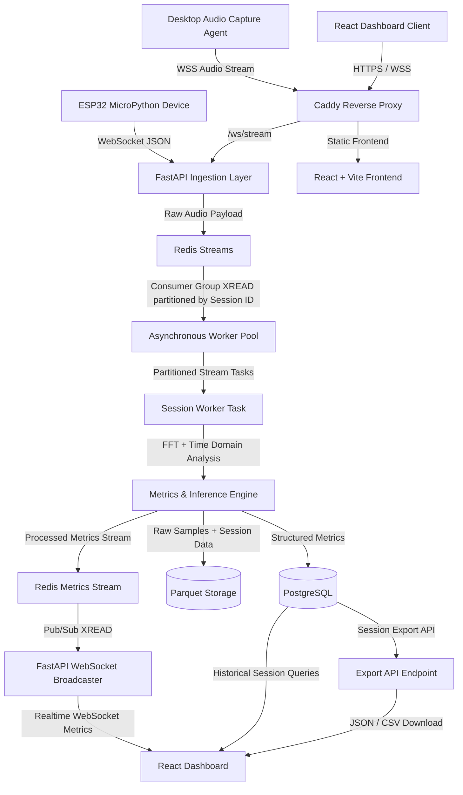
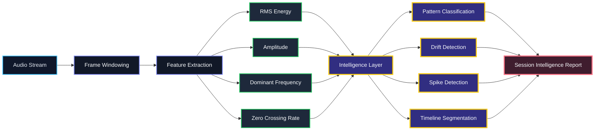

# Audio Waveform FFT Analyzer Dashboard

A comprehensive full-stack embedded and web system designed to capture analog audio, process the signal for real-time time-domain and frequency-domain analytics

## 🏗️ System Architecture

The architecture is entirely event-driven, decoupling ingestion from processing and presentation.



## 🌟 Key Features

###  Professional Analytic/intelligence Metrics from Raw Audio Samples
- **React + Vite Frontend**: High-performance, responsive UI crafted with a dark navy aesthetic.
- **Live Visualizations**: Synchronized scrolling oscilloscope (waveform),frequency spectrum (FFT) and zcr/rms/amp charts.
- **Session Management**: Live dashboard allows users to seamlessly switch subscriptions between active telemetry sessions.


### Session Intelligence Engine

The Session Intelligence Engine is a high-level acoustic analytics layer built on top of the real-time audio processing pipeline.

It transforms low-level waveform features into interpretable behavioral and spectral insights using lightweight statistical heuristics and rolling-window signal analysis.

The system continuously evaluates:

- RMS energy
- Peak amplitude
- Dominant frequency
- Zero Crossing Rate (ZCR)
- Temporal burst density
- Frequency drift
- Spectral consistency
- Activity transitions

This enables real-time classification of acoustic behavior, environmental instability, noise conditions, spike events, and temporal signal dynamics.

---


### Core Intelligence Modules

### Dominant Pattern

Represents the overall signal structure detected across the session timeline.

### Tonality Classification

Determines whether the signal behaves harmonically or resembles broadband noise.

### Derived From

- ZCR variance
- Frequency consistency
- Harmonic continuity

### Stability Class

Measures long-term consistency of spectral and energy behavior.

### Computed Using

- RMS variance
- Frequency variance
- Temporal continuity

## Activity Class

Estimates overall acoustic intensity and session occupancy.

### Derived From

- Burst density
- Energy occupancy
- Signal persistence

### Spike Profile

Detects transient high-energy acoustic events.

### Detection Logic

- RMS deviation thresholds
- Sudden amplitude excursions
- Short-duration spectral anomalies

### Drift Profile

Tracks long-term spectral movement using EMA-smoothed dominant frequency analysis.

### Frequency Drift Analysis

The frequency drift subsystem continuously monitors dominant spectral movement over time.

### Features

- Real-time dominant frequency tracing
- EMA (Exponential Moving Average) smoothing
- Drift slope estimation
- Long-term spectral stability analysis

---




### Derived Drift Metrics

| Metric | Description |
|---|---|
| **Slope (Hz/sample)** | Long-term directional frequency movement |
| **Burst Density** | Frequency instability occurrence rate |
| **Variance Spread** | Frequency dispersion across the session |
| **EMA Trendline** | Smoothed spectral movement estimate |

---

### Session Timeline Segmentation

The session timeline converts continuous audio into classified behavioral regions using rolling-window feature analysis.

Each segment is dynamically categorized based on spectral activity and energy distribution.

---

### Timeline States

| State | Meaning |
|---|---|
| `Quiet` | Minimal signal activity |
| `Stable` | Consistent harmonic behavior |
| `Active` | Elevated acoustic activity |
| `Burst-Heavy` | Frequent transient spikes |
| `Chaotic` | Highly unstable acoustic behavior |

---

### Acoustic Intelligence Observations

The engine generates contextual observations by combining multiple signal features and temporal metrics.

### Example Observations

- Moderate spike activity detected
- Noisy broadband environment identified
- Significant frequency drift observed
- Chaotic acoustic regions detected

---

### Observation Confidence Scoring

Each observation is assigned a confidence score derived from:

- Statistical certainty
- Feature agreement
- Temporal persistence

---

### Distribution Analysis

Histogram-based distribution analytics are generated for:

- RMS energy
- Amplitude
- Zero Crossing Rate (ZCR)

These distributions help identify:

- Energy concentration patterns
- Dynamic range spread
- Noise dominance
- Silence occupancy
- Signal consistency

---

### Signal Overview Visualization

The intelligence dashboard visualizes synchronized acoustic features over time.

### Visualized Metrics

- RMS energy trace
- Amplitude envelope
- ZCR evolution
- Spike markers
- Silence gaps
- Spectral transitions

---

### Enables Rapid Identification Of

- Acoustic instability
- Sudden transient events
- Environmental noise shifts
- Silence-to-activity transitions
- Sustained harmonic regions

---

### Technical Characteristics

| Capability | Description |
|---|---|
| **Real-Time Processing** | Continuous streaming acoustic analysis |
| **Lightweight Heuristics** | No heavyweight ML inference required |
| **Stream-Oriented Architecture** | Compatible with Redis stream pipelines |
| **Temporal Analysis** | Rolling-window behavioral segmentation |
| **Spectral Intelligence** | Frequency-aware acoustic interpretation |
| **Live Visualization** | WebSocket-driven dashboard updates |
| **Session Summarization** | End-of-session intelligence synthesis |

---

### System Design Goals

- Low-latency streaming analysis
- Lightweight computational footprint
- Real-time dashboard responsiveness
- Interpretable acoustic intelligence
- Modular feature extraction pipeline
- Extensible behavioral classification system

### Flow Overview
1. **Ingestion**: Audio devices send chunked sample arrays and tokens to the FastAPI publisher endpoint.
2. **Buffering**: Payloads are pushed to a Redis Stream partitioned by `session_id`.
3. **Processing**: The `StreamWorker` (part of the asynchronous worker pool) processes incoming stream batches using consumer groups, calculating FFT-based metrics and rhythmic patterns.
4. **Storage**: Analyzed metrics are batch-inserted into PostgreSQL while raw samples are flushed to Parquet files.
5. **Broadcasting**: A global async broadcaster reads processed metrics from Redis and fans them out to connected dashboard WebSockets.
6. **Data Export**: The dashboard or external clients can request session data exports via REST API, retrieving historical session metrics and raw data in structured formats like JSON or CSV.

### 🧮Advanced Metrics Engine (DSP)
The custom DSP engine (`MetricsEngine`) performs continuous processing on 1024-sample packets:
- **Time-Domain Analysis**: RMS Energy, Peak Amplitude, Zero-Crossing Rate (ZCR).
- **Frequency-Domain Analysis (FFT)**: Peak Frequency estimation, Spectral Centroid, Spectral Rolloff (85%), and Spectral Flatness.
- **Rhythm Detection**: Autocorrelation-based BPM calculation utilizing an energy envelope over time.

###  High-Performance Storage Layer
- **PostgreSQL Database**: Persistent storage for downsampled time-series audio metrics and session lifecycle management, accessed asynchronously via `asyncpg`.
- **Parquet Raw Storage**: Efficient columnar storage implementation for high-volume raw audio samples, optimizing disk I/O and enabling deep historical analysis.
- **Data Export**: Dedicated API endpoints for exporting session metrics and averages in JSON and CSV formats.
## 📊 Session Computation & Analysis Assumptions

The `MetricsEngine` executes an array of computations locally, abiding by the following assumptions and constraints for accuracy and performance:

### Baseline Normalizations
- **ADC Scaling**: Assumes hardware feeds 12-bit audio samples centered at `2048`. The engine applies an offset and scales values to a normalized `[-1.0, 1.0]` float range.
- **Sampling Parameters**: Default operations assume a uniform `48,000 Hz` sampling rate. Processing runs in discrete chunks (packets) of `1024` samples.
- **Windowing**: A standard Hann Window is applied to the time-domain data prior to FFT conversion to minimize spectral leakage at the chunk boundaries.

### Analysis Thresholds & Constraints
- **Silence Gating**: An RMS threshold of `0.005` is utilized. If a packet's RMS energy falls beneath this value, the packet is flagged as silent, and all respective metrics (frequency, BPM, centroids) are zeroed out to prevent noise amplification.
- **Frequency Bounds**: For peak frequency analysis, spectral bins are constrained between `20 Hz` and `5000 Hz` to reject DC bias (0 Hz) and extreme high-frequency hardware noise.
- **Spectral Rolloff**: Computed dynamically targeting **85%** of the total signal energy distribution.

### Rhythm (BPM) Autocorrelation
- **Energy Envelope**: Computed sequentially across rolling buffers. A minimum history of 60 packets is required before BPM calculation initiates.
- **Beat Constraints**: Valid peak intervals are filtered to bounds between `0.3s` and `1.5s` to strictly yield physiological or musical tempos lying between `40` and `200` BPM.

### Session Aggregations
- **Post-Session Summaries**: When exporting or querying a finalized session via the REST API, the system computes arithmetic averages spanning all collected rows for RMS energy, Peak Amplitude, and BPM to characterize the holistic session profile.
  

## 🚀 Getting Started

### Prerequisites
- Docker & Docker Compose
- Node.js 16+ & Python 3.8+ (for local development)

### 🐳 Docker Deployment (Recommended)
The fastest way to run the entire stack (PostgreSQL, Redis, FastAPI Backend, Processing Worker, Nginx Frontend) is via Docker Compose:

```bash
# Build and start all services
docker-compose up --build

# To stop the containers
docker-compose down
```

Access the Web Dashboard at: `http://localhost`

