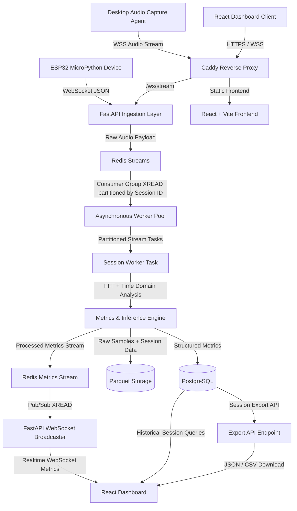
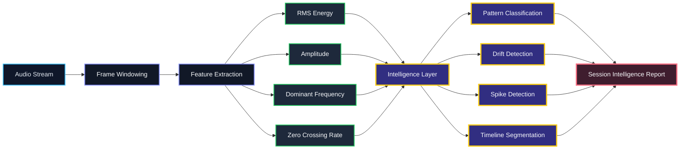

# Real-Time Audio Telemetry Platform

A comprehensive full-stack embedded and web system designed to capture analog audio, process the signal for real-time time-domain and frequency-domain analytics

## 🏗️ System Architecture

The architecture is entirely event-driven, decoupling ingestion from processing and presentation.



## 🌟 Key Features

###  Professional Analytic/intelligence Metrics from Raw Audio Samples
- **React + Vite Frontend**: High-performance, responsive UI crafted with a dark navy aesthetic.
- **Live Visualizations**: multiple live audio analylitic views including Synchronized scrolling oscilloscope (waveform),frequency spectrum (FFT) and zcr/rms/amp charts.
- **Session Management**: Live dashboard allows users to seamlessly switch subscriptions between active telemetry sessions.


## Performance Optimizations

This architecture has been heavily optimized for low-latency, real-time audio telemetry, ensuring a buttery-smooth visual experience without compromising backend scalability.

### Real-Time Performance

| Metric | Value | Details |
| :--- | :---: | :--- |
| **Render Frame Rate** | `60 / 120 FPS` | Vsync-locked via `requestAnimationFrame` — no manual throttle |
| **Render Backend** | `WebGL` | Hardware-accelerated `LINE_STRIP` draw, zero Canvas2D fallback |
| **Heap Allocations per Frame** | `0` | Pre-allocated `Float32Array(12,000)` vertex buffer, reused every frame |
| **Capture → Send Latency** | `< 1 ms` | Event-driven dispatch (`asyncio.Event`), zero polling delay |
| **Audio Capture Rate** | `48,000 Hz` | 1024-sample packets → ~47 packets/sec |
| **Ring Buffer Depth** | `48,000 samples` | 1 full second of audio history in memory |
| **Display Window** | `6,000 samples` | ~125 ms of waveform visible at any time |
| **Visual Smoothing** | `Spring Physics` | Lerp factor `0.08` decouples 47 FPS data from 60 FPS render |
| **Stale Packet Rejection** | `< 500 ms` | Packets exceeding 500 ms end-to-end latency are silently dropped |
| **Sequence Guard** | `Monotonic` | Out-of-order and replayed packets rejected via `packet_sequence` counter |
| **React Re-render Throttle** | `100 ms` | Metric state updates batched — only 10 React re-renders/sec max |
| **Backend JSON Overhead** | `Zero-copy` | Sample arrays pass through Redis as raw strings, never re-serialized |
| **FFT Compute** | `1× per packet` | Single 1024-point FFT shared across all spectral metric calculations |
| **WebSocket Heartbeat** | `30 s` | Application-level ping keeps connection alive through reverse proxies |
| **Redis Stream Depth** | `50 msgs` | Bounded `MAXLEN` per session prevents unbounded memory growth |


* **True Zero-Wait Capture:** Replaced traditional busy-polling with thread-safe asynchronous event signaling (`asyncio.Event`), ensuring network dispatch triggers the exact microsecond a hardware audio frame is captured.

* **Zero-Copy JSON Pipeline:** Completely eradicated array serialization bottlenecks on the backend. High-density float arrays (48kHz samples) bypass FastAPI's main event loop using raw string pass-throughs and f-string assembly, drastically reducing CPU load and Garbage Collection pauses.
* **Optimized DSP Overhead:** Mathematical pipelines were refactored to eliminate redundant operations. Complex transforms (like 1024-point FFTs) are computed exactly once per packet and shared across all spectral and frequency metric engines.

* **Vsync-Locked WebGL Rendering:** The dashboard achieves a locked 60/120 FPS by decoupling the visual render loop from the network packet rate. Using pre-allocated GPU vertex buffers and spring-physics interpolation, the waveform remains perfectly smooth regardless of network flutter.

* **Temporal Network Resilience:** End-to-end packet sequence tracking ensures that stale, replayed, or out-of-order packets are instantly dropped by the UI, guaranteeing a mathematically accurate and jitter-free waveform display.

## Session Intelligence Engine

The Session Intelligence Engine is a high-level acoustic analytics layer built on top of the real-time audio processing pipeline.

It transforms low-level waveform features into interpretable behavioral and spectral insights using lightweight statistical heuristics and rolling-window signal analysis.

The system continuously evaluates:

- RMS energy
- Peak amplitude
- Dominant frequency
- Zero Crossing Rate (ZCR)
- Temporal burst density
- Frequency drift
- Spectral consistency
- Activity transitions

This enables real-time classification of acoustic behavior, environmental instability, noise conditions, spike events, and temporal signal dynamics.

---


### Core Intelligence Modules

### Dominant Pattern

Represents the overall signal structure detected across the session timeline.

### Tonality Classification

Determines whether the signal behaves harmonically or resembles broadband noise.

### Derived From

- ZCR variance
- Frequency consistency
- Harmonic continuity

### Stability Class

Measures long-term consistency of spectral and energy behavior.

### Computed Using

- RMS variance
- Frequency variance
- Temporal continuity

## Activity Class

Estimates overall acoustic intensity and session occupancy.

### Derived From

- Burst density
- Energy occupancy
- Signal persistence

### Spike Profile

Detects transient high-energy acoustic events.

### Detection Logic

- RMS deviation thresholds
- Sudden amplitude excursions
- Short-duration spectral anomalies

### Drift Profile

Tracks long-term spectral movement using EMA-smoothed dominant frequency analysis.

### Frequency Drift Analysis

The frequency drift subsystem continuously monitors dominant spectral movement over time.

### Features

- Real-time dominant frequency tracing
- EMA (Exponential Moving Average) smoothing
- Drift slope estimation
- Long-term spectral stability analysis

---




### Derived Drift Metrics

| Metric | Description |
|---|---|
| **Slope (Hz/sample)** | Long-term directional frequency movement |
| **Burst Density** | Frequency instability occurrence rate |
| **Variance Spread** | Frequency dispersion across the session |
| **EMA Trendline** | Smoothed spectral movement estimate |

---

### Session Timeline Segmentation

The session timeline converts continuous audio into classified behavioral regions using rolling-window feature analysis.

Each segment is dynamically categorized based on spectral activity and energy distribution.

---

### Timeline States

| State | Meaning |
|---|---|
| `Quiet` | Minimal signal activity |
| `Stable` | Consistent harmonic behavior |
| `Active` | Elevated acoustic activity |
| `Burst-Heavy` | Frequent transient spikes |
| `Chaotic` | Highly unstable acoustic behavior |

---

### Acoustic Intelligence Observations

The engine generates contextual observations by combining multiple signal features and temporal metrics.

### Example Observations

- Moderate spike activity detected
- Noisy broadband environment identified
- Significant frequency drift observed
- Chaotic acoustic regions detected

---

### Observation Confidence Scoring

Each observation is assigned a confidence score derived from:

- Statistical certainty
- Feature agreement
- Temporal persistence

---

## Timeline Analysis Engine

The Timeline Analysis Engine transforms raw acoustic metrics into a structured, observability-grade interpretation of session behavior. Rather than simply plotting RMS values over time, the engine performs multi-stage signal analysis to identify activity patterns, environmental shifts, anomalies, behavioral phases, and long-term trends.


---

### Multi-Timescale Baseline Modeling

The analyzer maintains independent baseline models to separate short-term activity from long-term environmental conditions.

#### Fast Baseline
- Detects local activity changes
- Powers Active/Burst classification
- Preserves responsiveness to transient events

#### Slow Baseline
- Models the underlying acoustic environment
- Used for environmental shift detection
- Prevents sustained activity from being absorbed into the baseline

This dual-timescale architecture allows the system to distinguish between different acoustic behaviors:

| Scenario | Classification |
|-----------|---------------|
| Short loud spike | Burst |
| Sustained conversation | Active |
| Permanent environmental change | Environment Shift |
| Stable ambient sound | Steady |

---

### Robust State Machine Classification

Each sample is classified into one of four acoustic states:

| State | Description |
|---------|-------------|
| Quiet | Below expected baseline activity |
| Steady | Normal operating conditions |
| Active | Sustained elevated activity |
| Burst | Rapid transient acoustic events |

Classification uses:

- Robust MAD-normalized deviation scoring
- Hysteresis thresholds
- Persistence validation
- Gradient-aware burst detection

This prevents:

- Flickering state transitions
- Noise-driven burst hallucinations
- Single-sample spikes becoming false events

---

### Environment Shift Detection

The engine continuously monitors long-term baseline behavior using a validated CUSUM-based change detector.

#### Features

- Long-term drift tracking
- Permanent environment change detection
- Oscillation suppression
- Post-shift stability validation

### Multivariate Anomaly Detection

Anomalies are detected using a weighted Euclidean distance across multiple acoustic dimensions.

#### Analyzed Features

- RMS Energy
- Peak Amplitude
- Zero Crossing Rate (ZCR)

#### Capabilities

- Single-event anomaly detection
- Clustered incident generation
- Severity scoring
- False-positive suppression

#### Severity Levels

- Minor
- Major
- Critical

---

### Structural Phase Segmentation

The analyzer converts low-level state transitions into human-readable behavioral phases.

Example phase sequence:

```text
Steady State
    ↓
Sustained Activity
    ↓
Burst Cluster
    ↓
Steady State
```

Each phase contains:

- Start time
- End time
- Duration
- Confidence score

---

### Confidence-Aware Timeline Construction

Timeline confidence is calculated from multiple observability signals:

- Sample coverage
- Timestamp regularity
- Data validity ratio
- Baseline stability

This provides an estimate of timeline reliability under conditions such as:

- Packet loss
- Missing samples
- Sensor interruptions
- Irregular ingestion rates

---

### Trend Analysis

Long-term acoustic trends are extracted using robust statistical estimation techniques.

#### Output States

- Increasing
- Decreasing
- Stable

The implementation is designed to be resistant to:

- Outliers
- Burst spikes
- Temporary disturbances
- Short-lived anomalies

---

### Session Fingerprinting

The engine generates high-level behavioral summaries describing overall session dynamics.

#### Example Fingerprints

```text
Stable Ambient
Moderately Dynamic
Active Events Detected
Shifting Environments
Highly Dynamic
```

#### Additional Metrics

- Activity Intensity Index
- Baseline Drift Percentage
- Longest Stable Period
- Activity Volatility
- Transition Density
- Anomaly Density

---

### Event Extraction

The analyzer automatically extracts meaningful acoustic events.

#### Supported Event Types

- Sustained Activity
- Burst Events
- Environment Changes
- Structural Anomalies

Example event object:

```json
{
  "type": "environment_change",
  "timestamp": 123.4,
  "duration": 0.0,
  "description": "Environment Shift"
}
```

---

### Fact-Based Narrative Generation

Each session receives an automatically generated narrative summary derived directly from measured observations.

#### Example

> The session remained within its baseline range for 92% of its duration. A sustained activity period occurred at 3m 14s and lasted 47s. One structural anomaly was detected. No significant environmental shifts were observed.

The narrative is generated from detected facts rather than static templates, ensuring consistency with the underlying analysis.

---

## Validation & Reliability

Validation focuses on:

- False-positive suppression
- False-negative reduction
- Baseline stability
- Event accuracy
- Environment shift reliability
- Timeline confidence correctness

---

## Output Schema

The analyzer produces a structured session interpretation:

```json
{
  "baseline": {},
  "distribution": {},
  "segments": [],
  "events": [],
  "anomalies": [],
  "phases": [],
  "insights": {},
  "summary": ""
}
```

### Output Components

| Component | Description |
|------------|------------|
| baseline | Session-wide acoustic baseline metrics |
| distribution | Percentage distribution of activity states |
| segments | Classified timeline segments |
| events | Extracted acoustic events |
| anomalies | Clustered anomaly detections |
| phases | Human-readable behavioral phases |
| insights | Derived observability metrics |
| summary | Fact-based narrative description |

---

## Design Goals

The Timeline Analysis Engine is designed around the following principles:

- Deterministic results
- Explainable classifications
- Low false-positive rates
- Robust handling of missing data
- Real-time compatibility
- Observability-grade interpretability
- Frontend-stable API contract
- Human-readable outputs
- Statistically robust analysis

---

## Role in the Platform

The Timeline Analysis Engine serves as the intelligence layer that converts raw acoustic measurements into meaningful operational insights.

It enables users to understand not only **what happened**, but also:

- How the acoustic environment evolved
- When meaningful events occurred
- Whether environmental conditions changed
- How stable or dynamic a session was
- Which anomalies were structurally significant

By combining signal processing, statistical modeling, anomaly detection, and semantic interpretation, the engine transforms raw audio metrics into actionable observability insights.

---

## Technical Characteristics

| Capability | Description |
|---|---|
| **Real-Time Processing** | Continuous streaming acoustic analysis |
| **Lightweight Heuristics** | No heavyweight ML inference required |
| **Stream-Oriented Architecture** | Compatible with Redis stream pipelines |
| **Temporal Analysis** | Rolling-window behavioral segmentation |
| **Spectral Intelligence** | Frequency-aware acoustic interpretation |
| **Live Visualization** | WebSocket-driven dashboard updates |
| **Session Summarization** | End-of-session intelligence synthesis |

---

### System Design Goals

- Low-latency streaming analysis
- Lightweight computational footprint
- Real-time dashboard responsiveness
- Interpretable acoustic intelligence
- Modular feature extraction pipeline
- Extensible behavioral classification system

### Flow Overview
1. **Ingestion**: Audio devices send chunked sample arrays and tokens to the FastAPI publisher endpoint.
2. **Buffering**: Payloads are pushed to a Redis Stream partitioned by `session_id`.
3. **Processing**: The `StreamWorker` (part of the asynchronous worker pool) processes incoming stream batches using consumer groups, calculating FFT-based metrics and rhythmic patterns.
4. **Storage**: Analyzed metrics are batch-inserted into PostgreSQL while raw samples are flushed to Parquet files.
5. **Broadcasting**: A global async broadcaster reads processed metrics from Redis and fans them out to connected dashboard WebSockets.
6. **Data Export**: The dashboard or external clients can request session data exports via REST API, retrieving historical session metrics and raw data in structured formats like JSON or CSV.

### 🧮Advanced Metrics Engine (DSP)
The custom DSP engine (`MetricsEngine`) performs continuous processing on 1024-sample packets:
- **Time-Domain Analysis**: RMS Energy, Peak Amplitude, Zero-Crossing Rate (ZCR).
- **Frequency-Domain Analysis (FFT)**: Peak Frequency estimation, Spectral Centroid, Spectral Rolloff (85%), and Spectral Flatness.
- **Rhythm Detection**: Autocorrelation-based BPM calculation utilizing an energy envelope over time.

###  High-Performance Storage Layer
- **PostgreSQL Database**: Persistent storage for downsampled time-series audio metrics and session lifecycle management, accessed asynchronously via `asyncpg`.
- **Parquet Raw Storage**: Efficient columnar storage implementation for high-volume raw audio samples, optimizing disk I/O and enabling deep historical analysis.
- **Data Export**: Dedicated API endpoints for exporting session metrics and averages in JSON and CSV formats.
## 📊 Session Computation & Analysis Assumptions

The `MetricsEngine` executes an array of computations locally, abiding by the following assumptions and constraints for accuracy and performance:

### Baseline Normalizations
- **ADC Scaling**: Assumes hardware feeds 12-bit audio samples centered at `2048`. The engine applies an offset and scales values to a normalized `[-1.0, 1.0]` float range.
- **Sampling Parameters**: Default operations assume a uniform `48,000 Hz` sampling rate. Processing runs in discrete chunks (packets) of `1024` samples.
- **Windowing**: A standard Hann Window is applied to the time-domain data prior to FFT conversion to minimize spectral leakage at the chunk boundaries.

### Analysis Thresholds & Constraints
- **Silence Gating**: An RMS threshold of `0.005` is utilized. If a packet's RMS energy falls beneath this value, the packet is flagged as silent, and all respective metrics (frequency, BPM, centroids) are zeroed out to prevent noise amplification.
- **Frequency Bounds**: For peak frequency analysis, spectral bins are constrained between `20 Hz` and `5000 Hz` to reject DC bias (0 Hz) and extreme high-frequency hardware noise.
- **Spectral Rolloff**: Computed dynamically targeting **85%** of the total signal energy distribution.

### Rhythm (BPM) Autocorrelation
- **Energy Envelope**: Computed sequentially across rolling buffers. A minimum history of 60 packets is required before BPM calculation initiates.
- **Beat Constraints**: Valid peak intervals are filtered to bounds between `0.3s` and `1.5s` to strictly yield physiological or musical tempos lying between `40` and `200` BPM.

### Session Aggregations
- **Post-Session Summaries**: When exporting or querying a finalized session via the REST API, the system computes arithmetic averages spanning all collected rows for RMS energy, Peak Amplitude, and BPM to characterize the holistic session profile.
  

## 🚀 Getting Started

### Prerequisites
- Docker & Docker Compose
- Node.js 16+ & Python 3.8+ (for local development)

### 🐳 Docker Deployment (Recommended)
The fastest way to run the entire stack (PostgreSQL, Redis, FastAPI Backend, Processing Worker, Nginx Frontend) is via Docker Compose:

```bash
# Build and start all services
docker-compose up --build

# To stop the containers
docker-compose down
```

Access the Web Dashboard at: `http://localhost`

